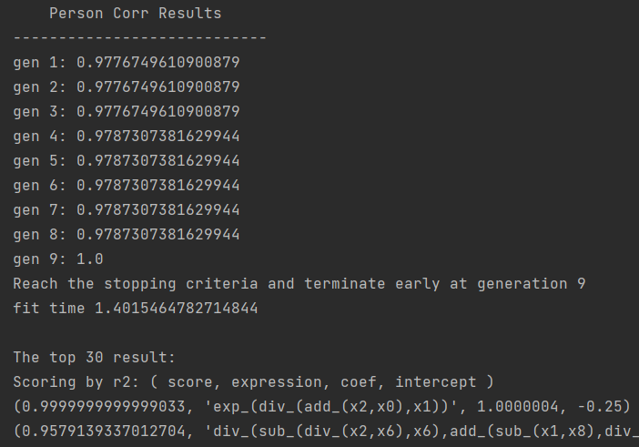
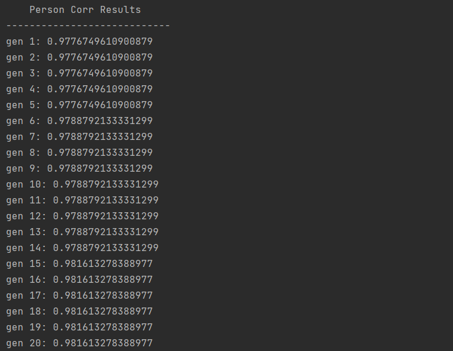

Formula Template
===================
Add user-preferential formula template restriction could accelerate the computation.

Parameter ``sci_template`` could be ``"default"``, ``None``, or user-defined template (type: list).

1. ``"default"``:  We built-in some formula templates. Such as :math:`y = exp(? / ?)` .
2. ``None``:  Not use template.
3. User-defined template (type: list): consult the author for details.

For target problem:

:math:`y = exp((X_0+X_2)/X_1)`

The ``"default"`` would be far faster than ``None`` to find the target expression, It is natural.

**Test Code:**

>>> import numpy as np
>>> from fastgplearn.skflow import SymbolicRegressor
>>> np.random.seed(0)
>>> x = np.random.random(size=(100, 10))
>>> x = x + 1
>>> x[:, 0] = 5*x[:, 0]
>>> x[:, 2] = 5*x[:, 2]
>>> y = np.random.random(size=100) * 0.01 + np.exp((x[:, 0]+x[:, 2]) / x[:, 1],)
>>> x = x.astype(np.float32)
>>> y = y.astype(np.float32)

**With template:**

>>> sr1 = SymbolicRegressor(population_size=10000, generations=30, stopping_criteria=1.0,
>>>                         constant_range=(0, 1.0), depth=(2, 4),
>>>                         function_set=('add', 'sub', 'mul', 'div',"exp"),random_state=0,
>>>                         sci_template="default")
>>>                         # sci_template=None)
>>> sr1.fit(x, y)
>>> sr1.top_n(30)

**Without template:**

>>> sr2 = SymbolicRegressor(population_size=10000, generations=30, stopping_criteria=1.0,
>>>                         constant_range=(0, 1.0), depth=(2, 4),
>>>                         function_set=('add', 'sub', 'mul', 'div',"exp"),random_state=0,
>>>                         #sci_template="default")
>>>                         sci_template=None)
>>> sr2.fit(x, y)
>>> sr2.top_n(30)

